# SoftLayerハンズオン サーバー管理 CentOS 6.x編


## 事前準備
------

- SoftLayerのアカウントは、事前取得していることを前提にしています。次の「SoftLayer 無料トライアルのご案内」を参照してください。
【SoftLayer無料トライアルのご案内】http://www.ibm.com/cloud-computing/jp/ja/softlayer_flow.html
- 当日は取得したアカウントを使用してハンズオンを行います。数十円程度の課金が発生します。
- SoftLayerのアカウントの解約について
全てのリソースがアカウントから削除されますと、お客様のアカウント環境はクローズされ、お手持ちのIDとパスワードでのログインが出来なくなり、事実上ご解約の扱いとなります。ただし、もし同じアカウントIDで再度アカウントを開通されたい場合にはSoftLayerの公式WEBサイト等のチャットにてお申し出頂く事で再度開通させて頂く事も可能です。
課金をされない状態でSoftLayerのアカウントは残しておきたいい場合は、Object Storageのアカウントを作成しておく事をお勧めします。
-	使用するブラウザは、Chromeか、Firefoxをお勧めします。Internet Explorerをお使いの場合、表示されなかったり、表示が崩れたりする事があります。
- 一部、管理ポータルとWebのドキュメント間で用語の不一致がありますが、管理ポータルの大幅な改良や、サービスカテゴリの見直しなどの過渡期にあるためです。


## 管理ポータルへのログイン

SoftLayerの利用は、管理ポータルから操作します。

- https://control.softlayer.com/ にアクセスして、ログインしてください。
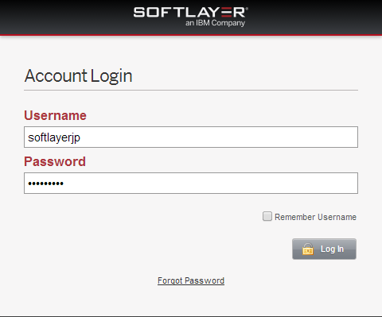  
- 最初にログオンされた方は、パスワードの変更を促されますので、変更してください。
- 同じネットワークからのログイン要求で、パスワードを連続3回間違えると、そのネットワークからのログイン要求を30分間遮断しますので、パスワードは慎重にいれてください。
- ブラウザは、Chrome、Firefoxをお勧めします。Internet Exploreは表示されない場合があります

## 仮想サーバーの利用
SoftLayer上では、WindowsやLinux、FreeBSD等様々なサーバOSが動くインスタンスをデプロイして利用することができます。Linuxでのハンズオンを希望する場合は引き続き5章以降を、Windowsでのハンズオンを希望する場合は9.1を読み進めてください。
### 仮想サーバのデプロイ
> 注意 : この作業は課金されます。無料トライアルアカウントユーザの場合、ご注意ください。
無料トライアルでアカウントを取得すると、仮想サーバが既に作成され起動しています。
この最初に作成された仮想サーバは無料で1ヶ月間利用することができます。
今回のハンズオンは、2台目の仮想サーバを作成しハンズオンを行います。
仮想サーバ1台につき、約$0.04/ hour課金されます。
※2014年6月20日現在

#### Order Device
管理ポータルから[Devices]→[Device List]を選んでください。さらに、次の画面から[Order Devices]をクリックしてください。
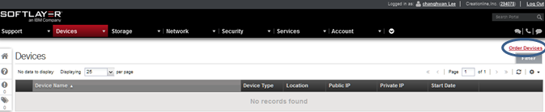

製品とサービスのオーダー画面が表示されますので、[Virtual Server (public node)]で、[Hourly]をクリックしてください。
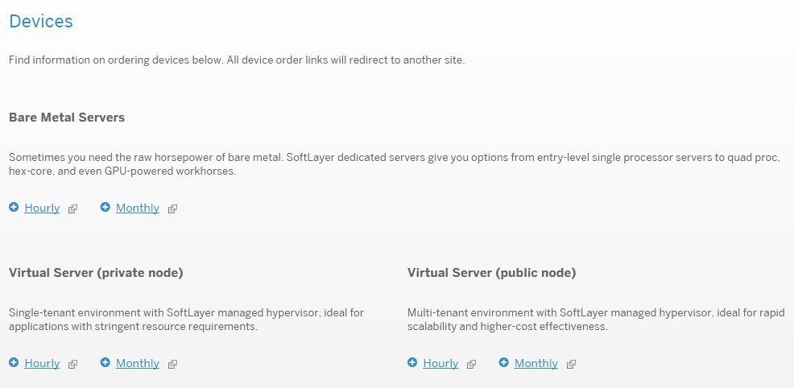

#### Quantity
サーバの数量を入力してください。
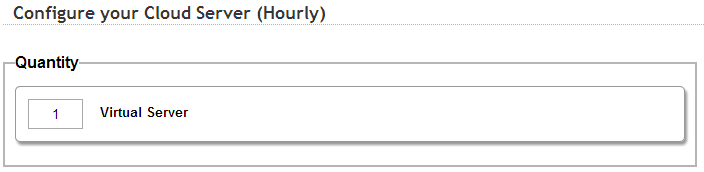
- 一度に作成できる最大のサーバ数は20台です。


#### Location
ロケーションはSJC01を選択してください。
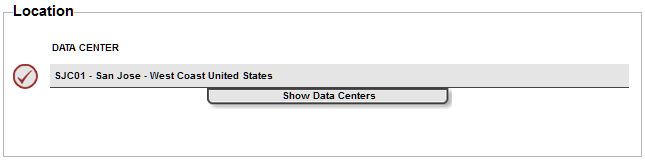

#### System Configuration
次は、CPU、RAM、OS、FIRST DISKを設定してください。OS以外はデフォルトでかまいません。OSは、CentOS、Redhat　Enterprise Linux、Ubuntu、Debian、Microsoft Windows、Vyattaから選択できます。今回はCentOS 6.x - Minimal Install (64 bit)を選択してください。
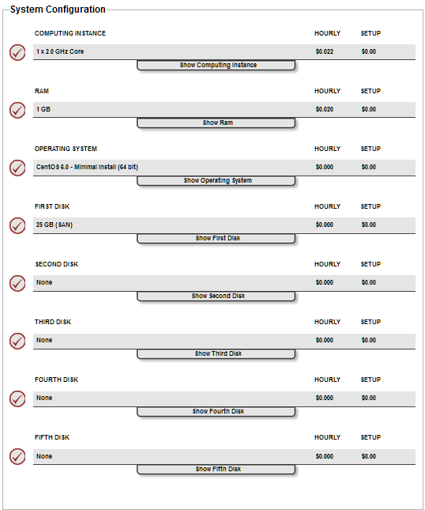

#### Network operations
今回はすべてデフォルトにしてください。詳細は[Show…]をクリックして確認してください。
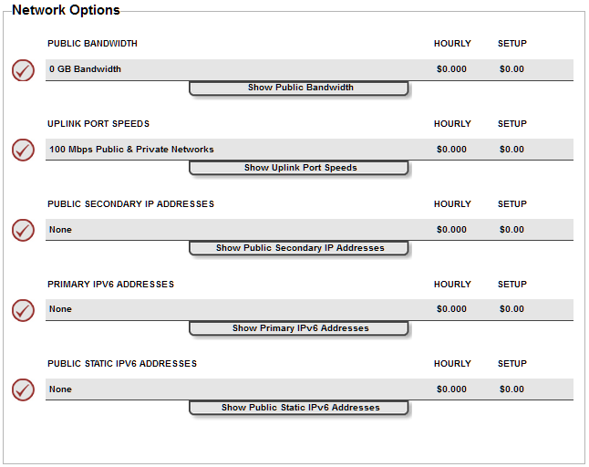

#### System Addons
**TODO:画像追加**  
今回はすべてデフォルトにしてください。詳細は[Show…]をクリックして確認してください。

#### Storage Addons
すべてデフォルトのままにします。詳細は[Show…]をクリックして確認してください。
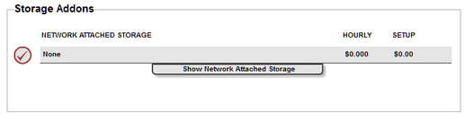


#### Service Addons
下記のように選択します。詳細は[Show…]をクリックして確認してください。  
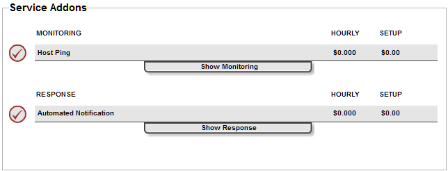

最後に、画面一番下の[Continue Your Order]をクリックしてください。  


#### Order Summary and Billing
オーダーの概要と請求内容が表示されますので、[Host and Domain Names]のセクションまでスクロールしてください。
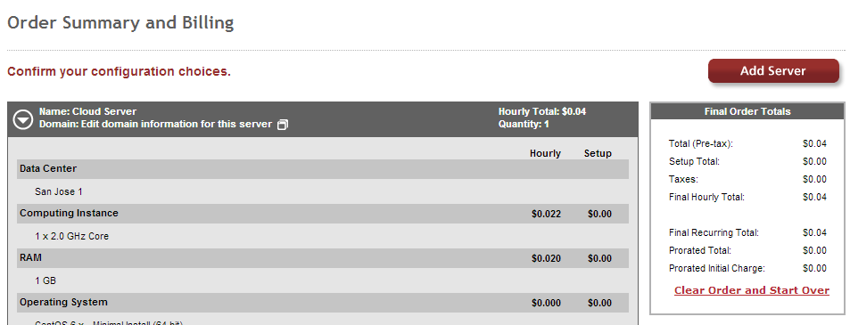

[Host and Domain Names]のセクションでホスト名とドメイン名を入力してください。このホスト名とドメイン名は実在しない仮の値でかまいません。実際にDNSに対しての操作は行われず、サーバを認識するためだけに用いられます。空欄ですとオーダーが確定できません。

> 注意 : 講師から貸与アカウントでハンズオンに参加されている方は下記のネーミングでサーバを作成してください。  
Hostname: “貸与されたアカウント名”  
Domain: ibm.com

サーバにログインするためのパスワードは自動生成されます。SSH鍵認証も利用可能です。
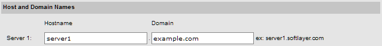
マスターサービスアグリーメントに同意して、[Finalize Your Order]をクリックしてください。


#### オーダー確定(Finalize Your Order)
オーダーが確定すると、次のようにオーダー受け付けた旨のレポート(Your Receipt)が表示されます。同時に、バーチャルサーバ（仮想サーバー）の起動を開始しています。  
オーダー内容を確認後、ウィンドウを閉じてください。
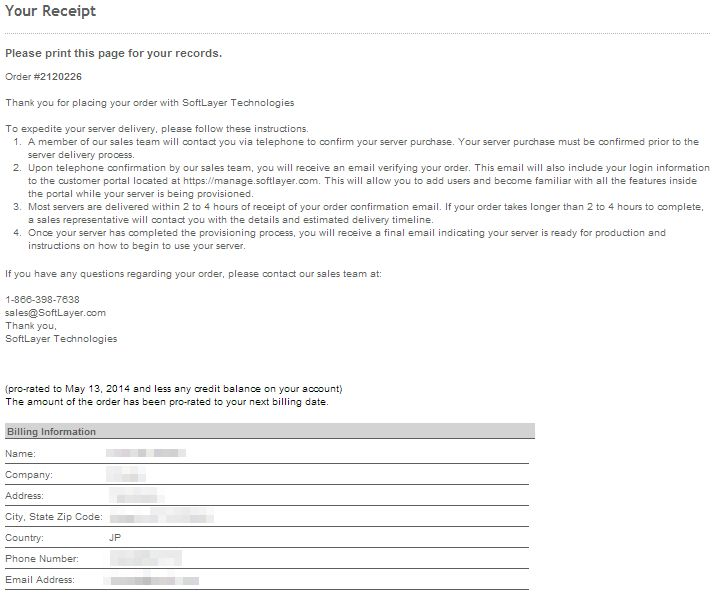


## CLI (Command Line Interface)

今回のハンズオンでCLIは、インストールと環境設定、使用法を紹介する程度に留めています。

### SoftLayerコマンドラインクライアントとは
SoftLayerコマンドラインクライアントとは、SoftLayerをコマンドラインから操作するためにPythonで作成されたツールです。

### SoftLayerコマンドラインクライアントのインストール
Pythonのeasy_installコマンドでCLIをインストールしてください。ここでは、自分の作成したサーバにSoftLayerコマンドラインクライアントをインストールします。

Red Hat系

```
$ yum install -y python-setuptools
$ easy_install importlib
$ easy_install softlayer
```

次のようにコマンドの解説を確認してください。

```
$ slcli
usage: slcli  [...]
       slcli help
       slcli help  
       slcli [-h | --help]

SoftLayer Command-line Client

The available modules are:

Compute:
  bmc       Bare Metal Cloud
  cci       Cloud Compute Instances
  image     Manages compute and flex images
  metadata  Get details about this machine. Also available with 'my' and 'meta'
  server    Hardware servers
  sshkey    Manage SSH keys on your account

Networking:
  dns       Domain Name System
  firewall  Firewall rule and security management
  globalip  Global IP address management
  rwhois    RWhoIs operations
  ssl       Manages SSL
  subnet    Subnet ordering and management
  vlan      Manage VLANs on your account

Storage:
  iscsi     View iSCSI details
  nas       View NAS details

General:
  config    View and edit configuration for this tool
  summary   Display an overall summary of your account
  help      Show help

See 'sl help ' for more information on a specific module.

To use most commands your SoftLayer username and api_key need to be configured.
The easiest way to do that is to use: 'sl config setup'
```

なお、WindowsでもCLIは使用可能です。次のドキュメントをご確認ください。
https://www.ibm.com/developerworks/community/files/form/anonymous/api/library/b1409dc8-fbc4-4d02-b799-b70334c67b92/document/78fa4030-97ab-4c70-8b7b-d15e90b469b4/media/SL_CLI%E5%B0%8E%E5%85%A5%E6%96%B9%E6%B3%95_20140213.pdf

プロジェクト・タイトル
======================
ここにプロジェクトの概要を書きます
行末にスペースを2つ入れると  
改行されます。

段落を分けるには、[空行](http://example.com/) を入れます。

使い方
------
### インライン ###
インラインのコードは、**バッククォート** (`` ` ``) で囲みます。

### ブロックレベル ###
    <script type="text/javascript" src="jquery.min.js"></script>
    <script type="text/javascript">
    $(function() {
        alert($); /* 先頭に4文字のスペース、
                     もしくはタブを挿入します */
    });
    </script>

パラメータの解説
----------------
リストの間に空行を挟むと、それぞれのリストに `<p>` タグが挿入され、行間が
広くなります。

    def MyFunction(param1, param2, ...)

+   `param1` :  
    _パラメータ1_ の説明

+   `param2` :  
    _パラメータ2_ の説明

関連情報
--------
### リンク、ネストしたリスト
1. [リンク1](http://example.com/ "リンクのタイトル")
    * 
2. [リンク2][link]
    - [![画像2][image]](https://github.com/)

  [link]: http://example.com/ "インデックス型のリンク"
  [image]: http://github.com/github.png "インデックス型の画像"

### 引用、ネストした引用
> これは引用です。
>
> > スペースを挟んで `>` を重ねると、引用の中で引用ができますが、
> > GitHubの場合、1行前に空の引用が無いと、正しくマークアップされません。

ライセンス
----------
Copyright &copy; 2011 IBM Japan
