# SoftLayerハンズオン サーバー管理 CentOS 6.x編


## 事前準備

- SoftLayerのアカウントは、事前取得していることを前提にしています。次の「SoftLayer 無料トライアルのご案内」を参照してください。
【SoftLayer無料トライアルのご案内】http://www.ibm.com/cloud-computing/jp/ja/softlayer_flow.html
- 当日は取得したアカウントを使用してハンズオンを行います。数十円程度の課金が発生します。
- SoftLayerのアカウントの解約について
全てのリソースがアカウントから削除されますと、お客様のアカウント環境はクローズされ、お手持ちのIDとパスワードでのログインが出来なくなり、事実上ご解約の扱いとなります。ただし、もし同じアカウントIDで再度アカウントを開通されたい場合にはSoftLayerの公式WEBサイト等のチャットにてお申し出頂く事で再度開通させて頂く事も可能です。
課金をされない状態でSoftLayerのアカウントは残しておきたいい場合は、Object Storageのアカウントを作成しておく事をお勧めします。
-	使用するブラウザは、Chromeか、Firefoxをお勧めします。Internet Explorerをお使いの場合、表示されなかったり、表示が崩れたりする事があります。
- 一部、管理ポータルとWebのドキュメント間で用語の不一致がありますが、管理ポータルの大幅な改良や、サービスカテゴリの見直しなどの過渡期にあるためです。


## 管理ポータルへのログイン

SoftLayerの利用は、管理ポータルから操作します。

- https://control.softlayer.com/ にアクセスして、ログインしてください。
  
- 最初にログオンされた方は、パスワードの変更を促されますので、変更してください。
- 同じネットワークからのログイン要求で、パスワードを連続3回間違えると、そのネットワークからのログイン要求を30分間遮断しますので、パスワードは慎重にいれてください。
- ブラウザは、Chrome、Firefoxをお勧めします。Internet Exploreは表示されない場合があります

## 3 仮想サーバーの利用
SoftLayer上では、WindowsやLinux、FreeBSD等様々なサーバOSが動くインスタンスをデプロイして利用することができます。Linuxでのハンズオンを希望する場合は引き続き5章以降を、Windowsでのハンズオンを希望する場合は9.1を読み進めてください。
### 仮想サーバのデプロイ
> 注意 : この作業は課金されます。無料トライアルアカウントユーザの場合、ご注意ください。
無料トライアルでアカウントを取得すると、仮想サーバが既に作成され起動しています。
この最初に作成された仮想サーバは無料で1ヶ月間利用することができます。
今回のハンズオンは、2台目の仮想サーバを作成しハンズオンを行います。
仮想サーバ1台につき、約$0.04/ hour課金されます。
※2014年6月20日現在

#### Order Device
管理ポータルから[Devices]→[Device List]を選んでください。さらに、次の画面から[Order Devices]をクリックしてください。  
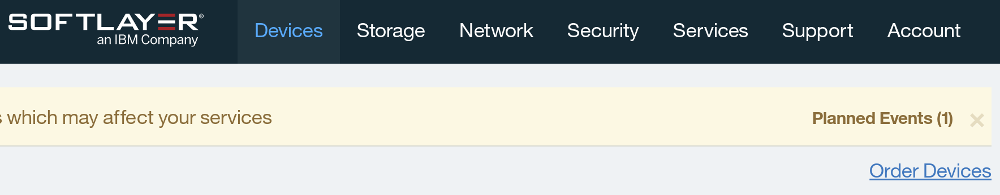

製品とサービスのオーダー画面が表示されますので、[Virtual Server (public node)]で、[Hourly]をクリックしてください。  


#### Quantity
サーバの数量を入力してください。  

- 一度に作成できる最大のサーバ数は20台です。


#### Location
ロケーションはSJC01を選択してください。  


#### System Configuration
次は、CPU、RAM、OS、FIRST DISKを設定してください。OS以外はデフォルトでかまいません。OSは、CentOS、Redhat　Enterprise Linux、Ubuntu、Debian、Microsoft Windows、Vyattaから選択できます。今回はCentOS 6.x - Minimal Install (64 bit)を選択してください。  
  

#### Network operations
今回はすべてデフォルトにしてください。詳細は[Show…]をクリックして確認してください。  
  

#### System Addons
**TODO:画像追加**  
今回はすべてデフォルトにしてください。詳細は[Show…]をクリックして確認してください。

#### Storage Addons
すべてデフォルトのままにします。詳細は[Show…]をクリックして確認してください。  
  


#### Service Addons
下記のように選択します。詳細は[Show…]をクリックして確認してください。    
  

最後に、画面一番下の[Continue Your Order]をクリックしてください。    
  

#### Order Summary and Billing
TODO: Provisioning scriptの説明
オーダーの概要と請求内容が表示されますので、[Host and Domain Names]のセクションまでスクロールしてください。  
  

[Host and Domain Names]のセクションでホスト名とドメイン名を入力してください。このホスト名とドメイン名は実在しない仮の値でかまいません。実際にDNSに対しての操作は行われず、サーバを認識するためだけに用いられます。空欄ですとオーダーが確定できません。
  
> 注意 : 講師から貸与アカウントでハンズオンに参加されている方は下記のネーミングでサーバを作成してください。  
Hostname: “貸与されたアカウント名”  
Domain: ibm.com

サーバにログインするためのパスワードは自動生成されます。SSH鍵認証も利用可能です。
マスターサービスアグリーメントに同意して、[Finalize Your Order]をクリックしてください。


#### オーダー確定(Finalize Your Order)
オーダーが確定すると、次のようにオーダー受け付けた旨のレポート(Your Receipt)が表示されます。同時に、バーチャルサーバ（仮想サーバー）の起動を開始しています。  
オーダー内容を確認後、ウィンドウを閉じてください。
  

### 仮装サーバの確認
メインウインドウにもどり、管理ポータルから[Devices]→[Device List]をクリックしてください。クラウドインスタンスが完全に起動すると、該当サーバのStart Date項目に、サーバ利用開始日付が表示されます。デバイス名の左側に時計のアイコンが表示されている場合はインスタンスの準備作業中です。

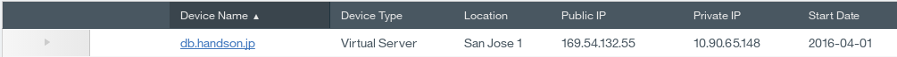  
デバイス名（ここでは、server1.mycompany.com）をクリックすると、詳細情報(Device Details)が表示されます。[Passwords]タブでパスワードを変更しても、実際のサーバには反映されないことに注意してください。今のところ、この情報はサーバと連携していません。パスワードの変更は実際のサーバ内で行ってください。
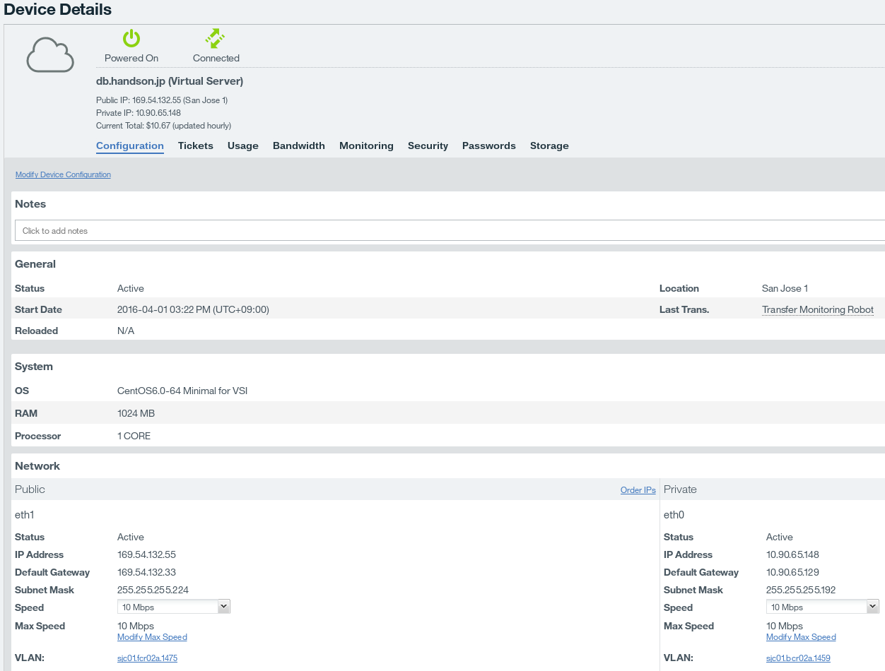  
- パスワードが表示されない場合は、画面をリロードしてください。

### 仮想サーバーへのログイン
バーチャルサーバへのログインは、Public IPアドレスに対して行いますので、まずはPublic IPアドレスを確認します。  

管理ポータルから[Devices]→[Device List]をクリックし、サーバ名の横の矢印をクリックします。
**TODO: 画像変更**
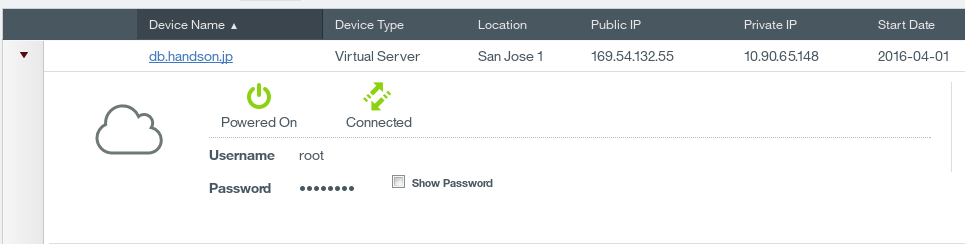  

作成されたサーバのPublic IPアドレスをメモしてください。  
Show Passwordをチェックし、rootのパスワードもメモしてください。

Tera TermやPuTTyなどのSSHクライアントソフトウェアを用いてログインしてください。本資料の手順では、Tera Termを使っています。SSHクライアントソフトウェアをインストールしてない場合は、下記リンクより、Tera Termをインストールしてください。インストール時、「コンポーネントの選択」では「コンパクトインストール」を選択し、それ以外はデフォルトで進めてください。  
Tera Term: http://sourceforge.jp/projects/ttssh2/

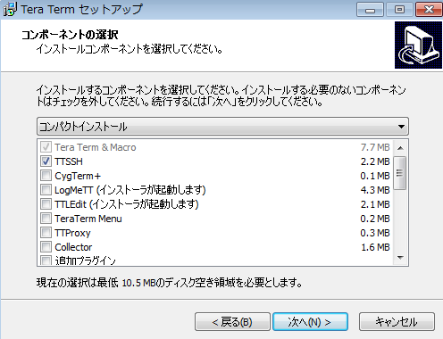  

Tera Termを起動し、先ほどメモしたPublic IPアドレスに接続します。  
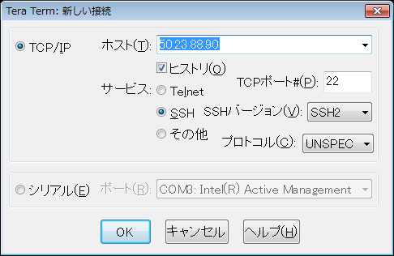  

先ほどメモした、rootパスワードを使用しログインします。
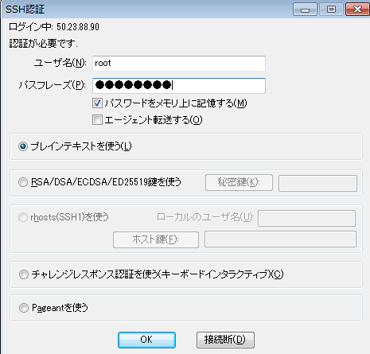  

特にパスワードが間違っていなければ、次のようにログインできます。
> Last login: Wed Mar 12 04:00:48 2014 from xxx.xxx.xxx.xxx.static.zoot.jp  
[root@server1 ~]#

### ネットワーク構成の確認
#### サーバ起動直後のネットワーク構成
SoftLayerのサーバは標準ではPublic VLANとPrivate VLANに接続された状態で起動します。そしてPublic VLANにはGlobal IPアドレスが、Private VLANにはPrivate IPアドレスが与えられています。  
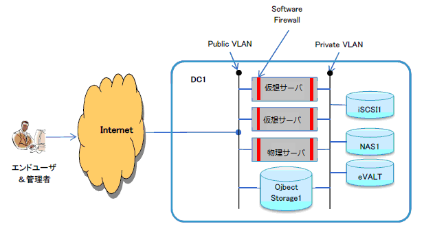    
次のようにifconfigコマンドでeth1にはGlobal IPアドレス、eth0にはPrivate IPアドレスが付与されていることを確認します。


    # ifconfig
      eth0      Link encap:Ethernet  HWaddr 06:17:0E:9D:FD:69
                inet addr:10.xxx.xxx.130  Bcast:10.xxx.xxx.191  Mask:255.255.255.192
                inet6 addr: fe80::417:eff:fe9d:fd69/64 Scope:Link
                UP BROADCAST RUNNING MULTICAST  MTU:1500  Metric:1
                RX packets:5326 errors:0 dropped:0 overruns:0 frame:0
                TX packets:2057 errors:0 dropped:0 overruns:0 carrier:0
                collisions:0 txqueuelen:1000
                RX bytes:5908309 (5.6 MiB)  TX bytes:227241 (221.9 KiB)
                Interrupt:246
      eth1      Link encap:Ethernet  HWaddr 06:4A:40:39:35:A7
                inet addr:50.xxx.xxx.98  Bcast:50.xxx.xxx.103  Mask:255.255.255.248
                inet6 addr: fe80::44a:40ff:fe39:35a7/64 Scope:Link
                UP BROADCAST RUNNING MULTICAST  MTU:1500  Metric:1
                RX packets:4108 errors:0 dropped:0 overruns:0 frame:0
                TX packets:3334 errors:0 dropped:0 overruns:0 carrier:0
                collisions:0 txqueuelen:1000
                RX bytes:672487 (656.7 KiB)  TX bytes:663662 (648.1 KiB)
                Interrupt:245
      以下略…

サーバ起動直後では、Linux標準のSoftware firewall (iptables)が起動しており、デフォルトでは、20 (ftpデータ), 21 (ftp制御), 22 (SSH), 25 (SMTP), 53 (DNS), 110 (POP3), 143 (IMAP), 443 (HTTPS), 3306 (MySQL) の通信を許可しています。

#### VLAN構成
管理ポータルから、[Device]→[Device List]→[作成したサーバ]をクリックして、ConfigurationのNetworkカテゴリを確認すると、Public VLANとPrivate　VLAN を確認できます。
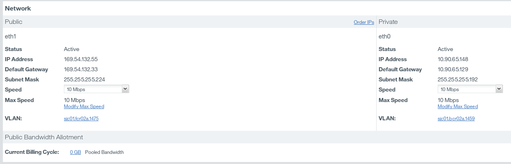  

Public VLANとPrivate　VLANをクリックをすると、それぞれサブネットと関連付けられていることがわかります。

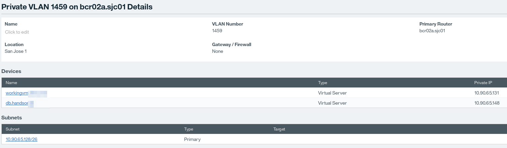  


#### サブネット構成
Public VLANとPrivate　VLAN それぞれのSubnetsカテゴリに表示されている、サブネットをクリックしてください。標準のサブネットは、次のように構成されています。  

|種類       |レンジ           |個数   |
|:--------:|:---------------:|:----:|
|Public IP |50.xxx.xxx.96/29 |16 IPs|
|Private IP|10.xxx.xxx.126/26|64 IPs|

Public Subnetには、トータルで16個のIPアドレスが与えられています。3つのIPアドレスはシステムが使っており、1つはバーチャルサーバに与えられていることがわかります。空いている4つのIPアドレス（Primary ip for future server only）は、同データセンター内で、次のインスタンスが起動するときに割り当てられます。
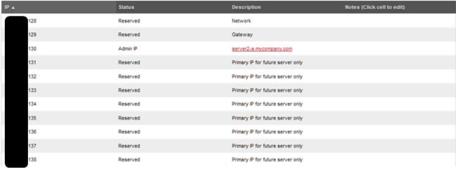  

Private Subnetには、トータルで64個のIPアドレスが与えられています。3つのIPアドレスはシステムが使っており、1つはバーチャルサーバに与えられていることがわかります。空いているIPアドレス（Primary ip for future server only）は、同データセンター内で、次のインスタンスが起動するときに割り当てられます。  
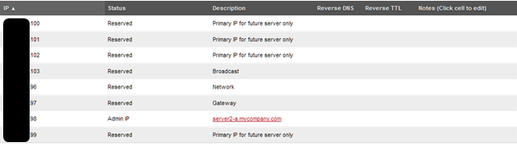  

### ファイアウォール設定
#### iptablesとは
iptablesは，Linux標準のネットワーク・セキュリティツールです．高機能なファイアウォールとして動作し送受信する通信を柔軟に制御できます．

#### iptablesの起動確認
Provisioning Scriptにより，自動的にiptablesがセットアップされ起動しています．デフォルトでは、20 (ftpデータ), 21 (ftp制御), 22 (SSH), 25 (SMTP), 53 (DNS), 110 (POP3), 143 (IMAP), 443 (HTTPS), 3306 (MySQL) の通信を許可しています。

    [root@iptables ~]# iptables -L
    Chain INPUT (policy DROP)
    target     prot opt source               destination
    ACCEPT     all  --  anywhere             anywhere
    ACCEPT     icmp --  anywhere             anywhere
    ACCEPT     tcp  --  anywhere             anywhere            tcp dpt:ftp-data
    ACCEPT     tcp  --  anywhere             anywhere            tcp dpt:ftp
    ACCEPT     tcp  --  anywhere             anywhere            tcp dpt:ssh
    ACCEPT     tcp  --  anywhere             anywhere            tcp dpt:smtp
    ACCEPT     tcp  --  anywhere             anywhere            tcp dpt:pop3
    ACCEPT     tcp  --  anywhere             anywhere            tcp dpt:imap
    ACCEPT     tcp  --  anywhere             anywhere            tcp dpt:https
    ACCEPT     tcp  --  anywhere             anywhere            tcp dpt:mysql
    ACCEPT     all  --  anywhere             anywhere            state RELATED,ESTABLISHED

    Chain FORWARD (policy ACCEPT)
    target     prot opt source               destination

    Chain OUTPUT (policy ACCEPT)
    target     prot opt source               destination
    ACCEPT     all  --  anywhere             anywhere

#### ファイアウォールの設定:接続を許可
iptablesを設定して，外部からSoftLayer上のVMへ接続出来るように設定を行います．SoftLayerのインスタンス上でWebサーバを起動し，ファイアウォールの設定を変更してWebサーバへの接続を許可してください．

    # yum -y install httpd  
    # service httpd start

現在，80(HTTP)との通信は許可されていないため，Webサーバに接続することは出来ません．接続できない事を確認するために，クライアントPCのWebブラウザからPublic IPアドレスに接続します。

    http://<作成したサーバのPublic IP>/

iptablesで80(HTTP)への通信が許可されていないため，接続に失敗してブラウザのエラー画面が表示されます．
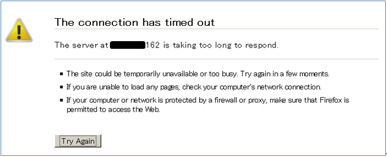  

次に，iptablesの設定で80(HTTP) の通信を許可し，再度Webサーバへ接続します．

    # iptables -A INPUT -p tcp -m tcp --dport 80 -j ACCEPT
    # iptables -L
    Chain INPUT (policy DROP)
    target     prot opt source               destination
    ACCEPT     all  --  anywhere             anywhere
    ACCEPT     icmp --  anywhere             anywhere
    ACCEPT     tcp  --  anywhere             anywhere            tcp dpt:ftp-data
    ACCEPT     tcp  --  anywhere             anywhere            tcp dpt:ftp
    ACCEPT     tcp  --  anywhere             anywhere            tcp dpt:ssh
    ACCEPT     tcp  --  anywhere             anywhere            tcp dpt:smtp
    ACCEPT     tcp  --  anywhere             anywhere            tcp dpt:pop3
    ACCEPT     tcp  --  anywhere             anywhere            tcp dpt:imap
    ACCEPT     tcp  --  anywhere             anywhere            tcp dpt:https
    ACCEPT     tcp  --  anywhere             anywhere            tcp dpt:mysql
    ACCEPT     all  --  anywhere             anywhere            state RELATED,ESTABLISHED
    ACCEPT     tcp  --  anywhere             anywhere            tcp dpt:http

    Chain FORWARD (policy ACCEPT)
    target     prot opt source               destination

    Chain OUTPUT (policy ACCEPT)
    target     prot opt source               destination
    ACCEPT     all  --  anywhere             anywhere

Chain INPUTの末尾に80(HTTP)を許可するルールが追加されたので，再度WebブラウザでPublic IPアドレスに接続します．．

    http://<作成したサーバのPublic IP>/

iptablesが適切に設定されていれば，Apache2 Test Pangeが表示されます．
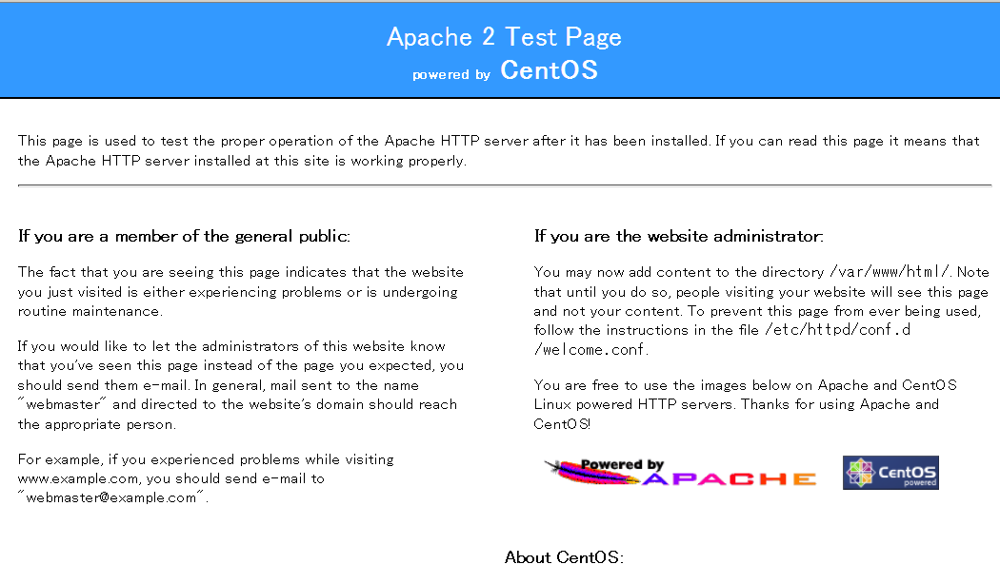

#### ファイアウォールの設定:接続を拒否
次は，通信を許可するルールを削除して，80(HTTP)への通信をブロックします．


    # iptables -L --line-numbers
    Chain INPUT (policy DROP)
    num  target     prot opt source               destination
    1    ACCEPT     all  --  anywhere             anywhere
    2    ACCEPT     icmp --  anywhere             anywhere
    3    ACCEPT     tcp  --  anywhere             anywhere            tcp dpt:ftp-data
    4    ACCEPT     tcp  --  anywhere             anywhere            tcp dpt:ftp
    5    ACCEPT     tcp  --  anywhere             anywhere            tcp dpt:ssh
    6    ACCEPT     tcp  --  anywhere             anywhere            tcp dpt:smtp
    7    ACCEPT     tcp  --  anywhere             anywhere            tcp dpt:pop3
    8    ACCEPT     tcp  --  anywhere             anywhere            tcp dpt:imap
    9    ACCEPT     tcp  --  anywhere             anywhere            tcp dpt:https
    10   ACCEPT     tcp  --  anywhere             anywhere            tcp dpt:mysql
    11   ACCEPT     all  --  anywhere             anywhere            state RELATED,ESTABLISHED
    12   ACCEPT     tcp  --  anywhere             anywhere            tcp dpt:http

    Chain FORWARD (policy ACCEPT)
    num  target     prot opt source               destination

    Chain OUTPUT (policy ACCEPT)
    num  target     prot opt source               destination
    1    ACCEPT     all  --  anywhere             anywhere

    # iptables -D INPUT 12

以上で80(HTTP)への通信を許可するルールが削除され，80(HTTP)への通信はブロックされます．


## イメージテンプレート
> 注意: この作業は月額、$0.25/GB課金されます。無料トライアルアカウントユーザの場合、ご注意ください。

### イメージの種類
SoftLayerには、スタンダードイメージとフレックスイメージと呼ばれる2種類のイメージテンプレートがあります。
- スタンダードイメージテンプレート  
スタンダードイメージテンプレートは、簡単に言えばサーバのバックアップの役割を果たします。SoftLayerは、このイメージテンプレートから新しいサーバを作成することができます。スタンダードイメージはバーチャルサーバにのみ対応しています。


- フレックスイメージテンプレート  
フレックスイメージテンプレートは、通常のイメージテンプレートと異なり、バーチャルサーバ、ベアメタルインスタンス、ベアメタルサーバ間で共有できます。ただし、現時点ではOSがWindows, Red Hat Enterprise Linux, CentOSでしかフレックスイメージは利用できません。
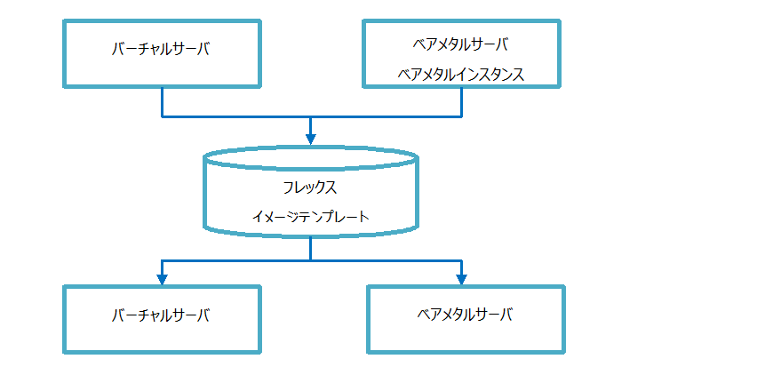  

本ハンズオンでは，スタンダードイメージテンプレートを用いて仮想マシンのスナップショットやスナップショットを用いたデプロイを行います．

### イメージテンプレート作成
管理ポータルから[Devices]→[Device List]をクリックしてデバイス一覧を表示してください。
イメージを作成したいサーバをクリックして、[Action]→[Create Image Template]をクリックしてください。

**TODO:画像変える**
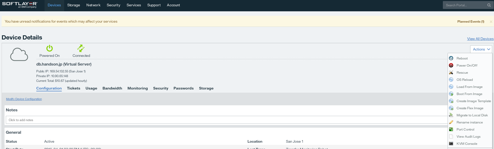

> 注意:下記のネーミングでイメージを作成してください。  
Image Name: “貸与されたアカウント名”-image 例: sluser01-image  
Note: “貸与されたアカウント名”-image 例: sluser01-image  

イメージs区政治に，取得するイメージに関する説明の入力が求められます．

|項目             |入力例           |備考   |
|:---------------:|:--------------:|:---------------------------:|
|*ImageName(必須) |server1-template|任意の名称                     |
|Note(任意)       |server1-template|任意の名称                     |
|Drive            |0               |拡張DISKがあれば複数表示されます|

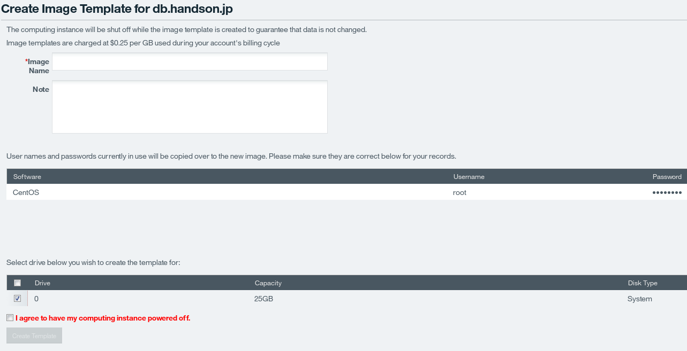

イメージテンプレート作成時には仮想サーバが自動的にPower Offの状態になります。仮想サーバでの作業などを完了し、Power Offにしてよければ[I agree to have my computing instance powered off]にチェックし、 [Create Template]をクリックしてください。10秒程度してテンプレート作成成功のメッセージが表示されますので、イメージ一覧を確認します。  

管理ポータルから[Device]→[Manage]→[Images]をクリックしてください。イメージ作成中は、[Transaction in progress]のステータスですが、10分程度でイメージの作成が完了します。次の図のようにCreate Dateに日付が表示されていれば、完了です。

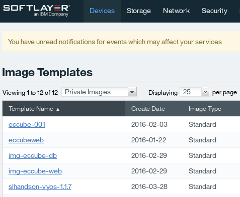

### イメージテンプレートを用いたデプロイ
**TODO: 画像**  
取得したイメージテンプレートを基に，仮装インスタンスをデプロイします．管理ポータルから[Device] – [Device list] – 自分のサーバと開き，右端の[Actions] – [Order Hourly Virtual Server]を選択してください．

注文ウィザードが表示されます．一番上の[Location] - [DATA CENTER] と，注文確定画面のHost and Domain Names設定肢，注文に進んで下さい．

  

以上で，イメージテンプレートを用いた仮想マシンのデプロイは完了しました．同じ構成のマシンを多数，高速に展開したい場合はイメージテンプレートを利用すると仁宗｀くなデプロイが可能です．

## CLI (Command Line Interface)

今回のハンズオンでCLIは、インストールと環境設定、使用法を紹介する程度に留めています。

### SoftLayerコマンドラインクライアントとは
SoftLayerコマンドラインクライアントとは、SoftLayerをコマンドラインから操作するためにPythonで作成されたツールです。

### SoftLayerコマンドラインクライアントのインストール
Pythonのeasy_installコマンドでCLIをインストールしてください。ここでは、自分の作成したサーバにSoftLayerコマンドラインクライアントをインストールします。


Red Hat系

```
$ yum install -y python-setuptools
$ easy_install importlib
$ easy_install softlayer
```

次のようにコマンドの解説を確認してください。

```
$ slcli
usage: slcli  [...]
       slcli help
       slcli help  
       slcli [-h | --help]

SoftLayer Command-line Client

The available modules are:

Compute:
  bmc       Bare Metal Cloud
  cci       Cloud Compute Instances
  image     Manages compute and flex images
  metadata  Get details about this machine. Also available with 'my' and 'meta'
  server    Hardware servers
  sshkey    Manage SSH keys on your account

Networking:
  dns       Domain Name System
  firewall  Firewall rule and security management
  globalip  Global IP address management
  rwhois    RWhoIs operations
  ssl       Manages SSL
  subnet    Subnet ordering and management
  vlan      Manage VLANs on your account

Storage:
  iscsi     View iSCSI details
  nas       View NAS details

General:
  config    View and edit configuration for this tool
  summary   Display an overall summary of your account
  help      Show help

See 'sl help ' for more information on a specific module.

To use most commands your SoftLayer username and api_key need to be configured.
The easiest way to do that is to use: 'sl config setup'
```

なお、WindowsでもCLIは使用可能です。次のドキュメントをご確認ください。
https://www.ibm.com/developerworks/community/files/form/anonymous/api/library/b1409dc8-fbc4-4d02-b799-b70334c67b92/document/78fa4030-97ab-4c70-8b7b-d15e90b469b4/media/SL_CLI%E5%B0%8E%E5%85%A5%E6%96%B9%E6%B3%95_20140213.pdf

プロジェクト・タイトル
======================
ここにプロジェクトの概要を書きます
行末にスペースを2つ入れると  
改行されます。

段落を分けるには、[空行](http://example.com/) を入れます。

使い方
------
### インライン ###
インラインのコードは、**バッククォート** (`` ` ``) で囲みます。

### ブロックレベル ###
    <script type="text/javascript" src="jquery.min.js"></script>
    <script type="text/javascript">
    $(function() {
        alert($); /* 先頭に4文字のスペース、
                     もしくはタブを挿入します */
    });
    </script>

パラメータの解説
----------------
リストの間に空行を挟むと、それぞれのリストに `<p>` タグが挿入され、行間が
広くなります。

    def MyFunction(param1, param2, ...)

+   `param1` :  
    _パラメータ1_ の説明

+   `param2` :  
    _パラメータ2_ の説明

関連情報
--------
### リンク、ネストしたリスト
1. [リンク1](http://example.com/ "リンクのタイトル")
    * 
2. [リンク2][link]
    - [![画像2][image]](https://github.com/)

  [link]: http://example.com/ "インデックス型のリンク"
  [image]: http://github.com/github.png "インデックス型の画像"

### 引用、ネストした引用
> これは引用です。
>
> > スペースを挟んで `>` を重ねると、引用の中で引用ができますが、
> > GitHubの場合、1行前に空の引用が無いと、正しくマークアップされません。

ライセンス
----------
Copyright &copy; 2011 IBM Japan
