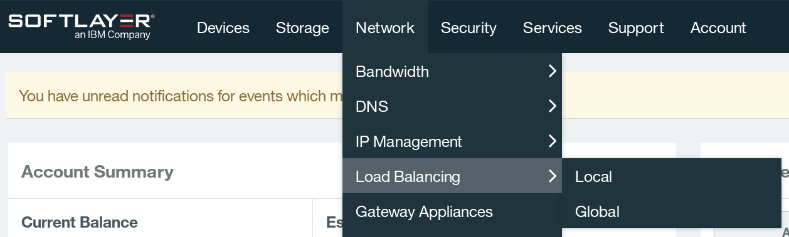
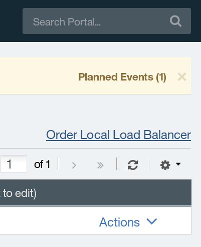
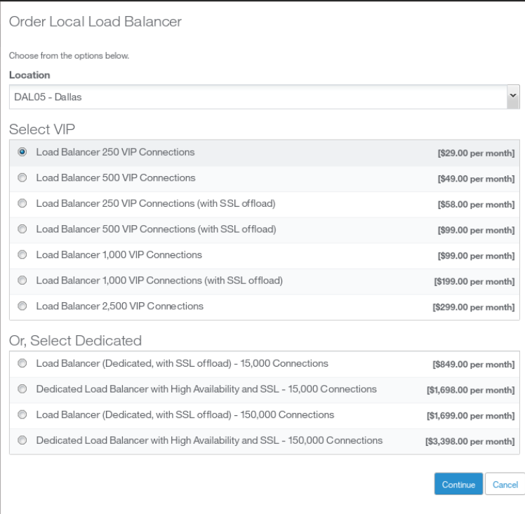
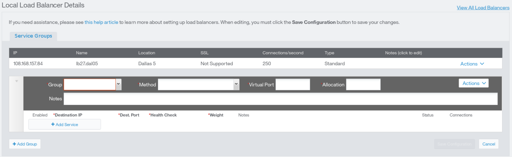

# SoftLayerハンズオン サーバー管理 ネットワーク編


## 事前準備

- SoftLayerのアカウントは、事前取得していることを前提にしています。次の「SoftLayer 無料トライアルのご案内」を参照してください。
> 【SoftLayer無料トライアルのご案内<br>】http://www.ibm.com/cloud-computing/jp/ja/softlayer_flow.html

- 当日は取得したアカウントを使用してハンズオンを行います。数十円程度の課金が発生します。
- SoftLayerのアカウントの解約について
全てのリソースがアカウントから削除されますと、お客様のアカウント環境はクローズされ、お手持ちのIDとパスワードでのログインが出来なくなり、事実上ご解約の扱いとなります。ただし、もし同じアカウントIDで再度アカウントを開通されたい場合にはSoftLayerの公式WEBサイト等のチャットにてお申し出頂く事で再度開通させて頂く事も可能です。
課金をされない状態でSoftLayerのアカウントは残しておきたいい場合は、Object Storageのアカウントを作成しておく事をお勧めします。
-	使用するブラウザは、Chromeか、Firefoxをお勧めします。Internet Explorerをお使いの場合、表示されなかったり、表示が崩れたりする事があります。
- 一部、管理ポータルとWebのドキュメント間で用語の不一致がありますが、管理ポータルの大幅な改良や、サービスカテゴリの見直しなどの過渡期にあるためです。


## 管理ポータルへのログイン

SoftLayerの利用は、管理ポータルから操作します。

- https://control.softlayer.com/ にアクセスして、ログインしてください。
  
> - 最初にログオンされた方は、パスワードの変更を促されますので、変更してください。<br>
>- 同じネットワークからのログイン要求で、パスワードを連続3回間違えると、そのネットワークからのログイン要求を30分間遮断しますので、パスワードは慎重にいれてください。<br>
>- ブラウザは、Chrome、Firefoxをお勧めします。Internet Exploreは表示されない場合があります

## Load Balancing
Load Balancingサービスは、大規模で負荷が大きいサービスを運営する際に負荷を分散するサービスです。Load Balancingサービスによって、1つのIPアドレスで受け付けた要求を配下の複数のサーバに分散することで、大規模なサービスを運営する際に特定のマシンに負荷が集中してサービス全体が停止してしまう状況を事前に防ぎます。

### Load Balancingの種類
SoftLayerの提供するLoad Balancingサービスには2種類心材します。

- Local

一つのデータセンター内部に展開されている複数のサーバを一つに集約してサービスを提供する

- Global

複数の分散した地域に展開されているサーバ群を纏めてサービスを提供する

SoftLayerで世界規模に展開するサービスを運営する場合は、一つのGlobal Load Balancingサービスと各地域のデータセンターに展開されるサーバ群を束ねるLocal Load Balancingサービスを組み合わせることで実現可能です。

本ハンズオンでは一つのデータセンターに二台のサーバを展開し、Local Load Balancingサービスを利用してこれらのサーバを統合し、一つのサービスのように展開します。

### サーバの展開
Load Balancingを利用するための背後のサーバとして、サーバを2台注文します。ポータルのトップページより、Device -> Device Listを開き、画面右上のOrder Devicesをクリックします。

注文画面が表示されたらVirtual server (public node)のHourlyをクリックして注文を続けてください。


注文ウィザードが始まったら、以下の構成で仮想マシンを2台注文してください。

|項目名                      |パラメータ                                                                               |
|:--------------------------:|:---------------------------------------------------------------------------------------:|
|Data Center                 |San Jose 1                                                                               |
|Operating System            |CentOS 6.x - Minimal Install (64 bit)                                                    |
|Advanced Monitoring         |None                                                                                     |
|Hardware & Software Firewall|None                                                                                     |
|Monitoring                  |Host Ping                                                                                |
|Response                    |Automated Notification                                                                   |
|Provisioning Scripts        |指定なし                                                                                 |
|Host Name                   |ご自身のアカウントを利用している方: 任意<br>IBM から貸与したアカウントを利用している方: アカウント名|
|Domain Name                 |ご自身のアカウントを利用している方: 任意<br>IBM から貸与したアカウントを利用している方: handson.jp  |

注文時の仮想インスタンスの構成で、一番上のQuantityを1から2へ、Operating Systemを「CentOS 6.x Minimal Install (64 bit)」へ変更し、注文決定画面へと移動してください。注文確定画面では、2台の仮想インスタンスの片方のHostnameをlb1-local、もう片方をlb2-localとして注文を確定してください。


注文とデプロイが完了したら、再度Device -> Device Listを表示し、それぞれのマシンの左の三角をクリックして情報を表示し、Show Passwordにチェックを入れてログイン用のパスワードを確認し、注文したホストにSSHで接続します。


```
SoftLayer上に展開した仮想インスタンスへのSSHでの接続方法は、SoftLayerハンズオン資料 サーバ管理編(http://ibm.biz/slhandson12 ) にて紹介しておりますので併せてご利用ください。)
```

ログインしたら、デプロイした2台の仮想インスタンス療法でWebサーバをインストールして起動します。3行目でechoしている文字列が異なることに注意してください。

**[COMMAND]**

```
[root@lb1-local ~]# yum –y install httpd
[root@lb1-local ~]# /etc/init.d/httpd start
[root@lb1-local ~]# echo *lb1-local* > /var/www/html/index.html
```

**[COMMAND]**

```
root@lb2-local ~]# yum –y install httpd
[root@lb2-local ~]# /etc/init.d/httpd start
[root@lb2-local ~]# echo *lb2-local* > /var/www/html/index.html
```

それぞれのWebサーバが適切に動いていることを確認するために、二台の仮想インスタンスのグローバルIPアドレスをブラウザで開いて応答があることを確認してください。「lb1-local」「lb2-local」と表示されれば成功です。

### Local Load Balancerの注文
サーバの展開が終了したら、次はLocal Load Balancingの構築を行います。管理ポータルのトップからNetwork -> Load Balancing -> Localの順にクリックします。



続いて、右上のOrder Local Load Balancerをクリックして、Local Load Balancerの注文画面を開きます。

以下の注文画面が表示されたら、LocationでプルダウンメニューからLocal Load Balancingを展開するデータセンターを選択します。
仮想マシンをデプロイしたデータセンターと同じ場所を選んでください。

Select VIPで、注文したいロードバランスの種類を選択します。表示される250、500、1000、2500は、Local Load Balancerが1秒ごとに処理できるコネクション数を、(with SSL offloading)は追加でSSLのオフロードが機能の有無を表しています。本ハンズオンでは一番上の250 VIPを選択してください。



Continueを押すと、注文閣員画面が表示されるので、再度確認しチェックボックスにチェックを入れて注文を確定してください。



これでLocal Load Balancingの注文は完了です。続いてLocal Load Balancingの設定です。

### Local Load Balancerの設定
再度管理ポータルのトップからNetwork - Load Balancing - Localの順にクリックし、右隅のAdd Service Groupをクリックし、新しい設定を作成します。




